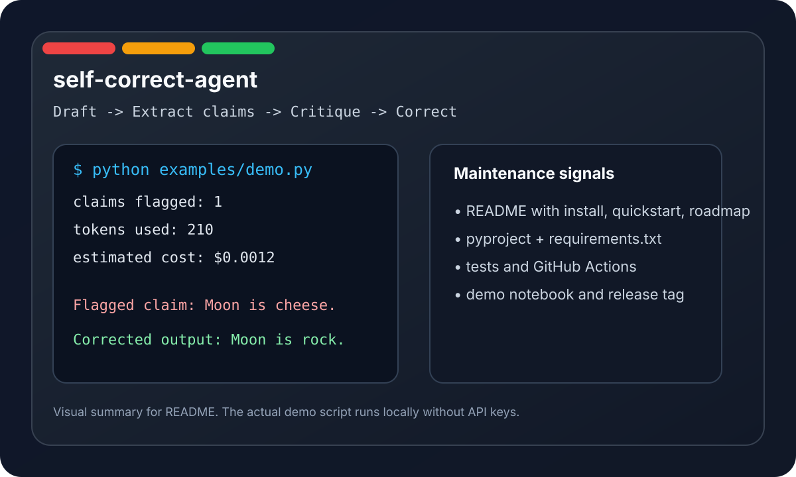

# Self-Correct Agent

[](https://github.com/Muhtasim-Munif-Fahim/self-correct-agent/actions)
[](https://www.python.org/downloads/)
[](LICENSE)
[](https://pypi.org/project/self-correct/)

`self-correct-agent` is a small Python library for wrapping an LLM client with a Chain-of-Verification workflow. It drafts a response, extracts factual claims, critiques each claim, and rewrites the output when unsupported statements are found.

It is designed for people who want a practical hallucination-reduction layer without having to replace their existing OpenAI-compatible client.

## Problem

LLMs are useful at drafting text, but they still make confident mistakes. In production workflows that matters more than benchmark scores: one fabricated date, one unsupported citation, or one wrong number can make the whole answer unusable.

This package turns that failure mode into a repeatable maintenance step:

1. Draft an answer.
2. Extract discrete factual claims.
3. Verify each claim.
4. Rewrite the draft when claims are weak or false.

## Features

- 4-phase Chain-of-Verification pipeline: draft, extract, critique, correct.
- OpenAI-compatible client support through `client.chat.completions.create()`.
- Pluggable verification **Tool** interface with three built-in backends:
  - `DuckDuckGoSearchTool` — web search (default)
  - `WikipediaSearchTool` — Wikipedia article summaries
  - `StaticKnowledgeTool` — user-provided knowledge base (dict, JSON file, or URL)
- Async claim verification for faster checks on long drafts.
- Thread-safe LRU cache for repeated claim verification.
- Token usage tracking and simple cost estimation.
- Custom prompts for draft, extraction, critique, and correction stages.
- Rich report exports: `to_dict()`, `to_json()`, `to_markdown()`.
- Command-line interface with `verify`, `batch`, and `info` subcommands.

## Installation

```bash
pip install self-correct

# Development install with all tools and tests
pip install -e ".[dev,search]"
```

If you prefer pinned local development dependencies:

```bash
pip install -r requirements.txt
```

## Quickstart

```python
from openai import OpenAI
from self_correct import AntiHallucinator

client = OpenAI()
safe = AntiHallucinator(client=client, strictness=1.0)

response = safe.generate(
    model="gpt-4o-mini",
    prompt="Explain the Transformer architecture in two short paragraphs.",
)

print(response.content)
print("claims flagged:", len(response.hallucinations_caught))
print("tokens used:", response.token_usage.total_tokens)
```

## Verification Tools

### DuckDuckGo (web search)

```python
from self_correct import AntiHallucinator, DuckDuckGoSearchTool

safe = AntiHallucinator(
    client=client,
    strictness=1.0,
    tools=[DuckDuckGoSearchTool()],
)

response = safe.generate(model="gpt-4o-mini", prompt="What is the population of Tokyo?")
```

### Wikipedia (article summaries)

```python
from self_correct import AntiHallucinator, WikipediaSearchTool

safe = AntiHallucinator(
    client=client,
    strictness=1.0,
    tools=[WikipediaSearchTool(lang="en")],
)
```

### Static knowledge base

```python
from self_correct import StaticKnowledgeTool

# From a dictionary
kb = StaticKnowledgeTool({
    "tokyo population": "Tokyo has ~14 million residents.",
    "einstein": "Developed the theory of relativity.",
})

# From a JSON file
kb = StaticKnowledgeTool.from_json("knowledge.json")

# From a URL
kb = StaticKnowledgeTool.from_json_url("https://example.com/kb.json")

safe = AntiHallucinator(client=client, tools=[kb])
```

### Multiple tools

```python
safe = AntiHallucinator(
    client=client,
    strictness=1.0,
    tools=[DuckDuckGoSearchTool(), WikipediaSearchTool()],
)
```

## Report Exports

Responses can be exported in multiple formats:

```python
result = safe.generate(model="gpt-4o-mini", prompt="...")

# Plain dictionary
data = result.to_dict()

# JSON string
print(result.to_json(indent=2))

# Markdown report (with optional verification log)
print(result.to_markdown(include_log=True))
```

## CLI

The package ships with a `self-correct` CLI:

```bash
# Verify a single prompt
self-correct verify --model gpt-4o-mini --prompt "Explain quantum computing."

# Read prompt from file and output as JSON
self-correct verify --model gpt-4o-mini --file input.txt --output report.json

# Enable verification tools
self-correct verify --model gpt-4o-mini --prompt "..." --tools duckduckgo wikipedia

# Markdown report with full verification log
self-correct verify --model gpt-4o-mini --file input.txt --output-format markdown --include-log

# Batch process multiple prompts (JSONL format)
echo '{"id": "1", "prompt": "Explain transformers"}
{"id": "2", "prompt": "What is RLHF?"}' > prompts.jsonl

self-correct batch --input prompts.jsonl --output results.jsonl --model gpt-4o-mini

# Show package info
self-correct info
```

### Batch JSONL format

Input file (one JSON object per line):

```jsonl
{"id": "001", "prompt": "Explain the Transformer architecture."}
{"id": "002", "prompt": "What is the capital of France?"}
{"id": "003", "prompt": "Describe quantum entanglement."}
```

Output file (adds verification results to each input line):

```jsonl
{"id": "001", "content": "...", "hallucinations_caught": [], "token_usage": {...}, "elapsed_seconds": 1.23}
{"id": "002", "content": "...", "hallucinations_caught": ["Claim '...' flagged: ..."], "token_usage": {...}, "elapsed_seconds": 0.89}
```

## Demo

The repository includes a self-contained demo that uses a mocked client, so it runs without API keys.

- Script: [`examples/demo.py`](examples/demo.py)
- Notebook: [`examples/demo.ipynb`](examples/demo.ipynb)
- Tool comparison demo: [`examples/tool_comparison_demo.py`](examples/tool_comparison_demo.py)

The screenshot below is a lightweight visual summary of the pipeline and demo output.



## How It Works

1. **Draft** - generate a first-pass response.
2. **Extract** - identify factual claims in the draft.
3. **Critique** - verify each claim, optionally using tools.
4. **Correct** - rewrite the draft to remove unsupported claims.

## API Highlights

```python
safe = AntiHallucinator(
    client=client,
    strictness=1.0,
    cache_size=256,
    draft_system_prompt="You are a careful assistant.",
    extraction_prompt="Extract only factual claims.",
    critique_prompt="Check claims against evidence.",
    correction_prompt="Rewrite conservatively.",
)

print(safe.cache_size)
safe.clear_cache()
```

## Tests

Run the test suite locally:

```bash
python -m pytest -q
```

The CI workflow also runs the demo script so the repository keeps a working example path, not just unit tests.

## Roadmap

- [x] ~~Add more reference tools beyond web search.~~ ? v0.2.0
- [x] ~~Expose a small CLI for batch verification workflows.~~ ? v0.2.0
- [x] ~~Add richer reporting formats for verification results.~~ ? v0.2.0
- [ ] Publish additional examples for research and policy writing use cases.
- [ ] Structured output extraction via OpenAI function calling.
- [ ] Hallucination density scoring.

## Release Notes

- **v0.2.0** — WikipediaSearchTool, StaticKnowledgeTool, CLI, batch mode, report exports.
- **v0.1.0** — Initial release: CoVe pipeline, DuckDuckGo tool, async, cache.

## References

- Dhuliawala, S. et al. (2023). *Chain-of-Verification Reduces Hallucination in Large Language Models.* [arXiv:2309.11495](https://arxiv.org/abs/2309.11495)
- Min, S. et al. (2023). *FActScore: Fine-grained Atomic Evaluation of Factual Precision in Long Form Text Generation.* [arXiv:2305.14251](https://arxiv.org/abs/2305.14251)

## Contributing

See [CONTRIBUTING.md](CONTRIBUTING.md) for setup, testing, and pull request guidance.

## License

MIT - see [LICENSE](LICENSE).
